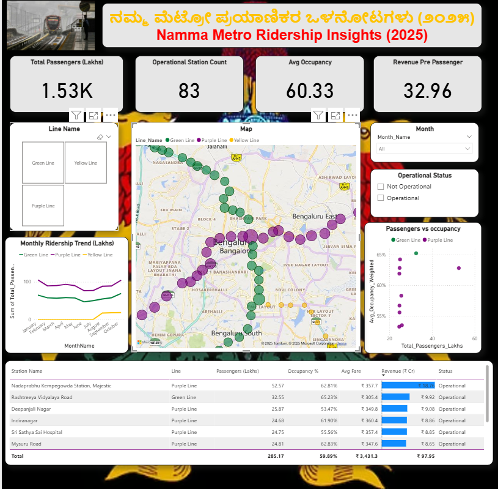

# 🚇 Bengaluru Metro Ridership & Revenue Analysis (Jan–Oct 2025)

This project presents an interactive **Power BI dashboard** analyzing **Namma Metro (Bengaluru)** ridership, occupancy, and revenue trends from **January to October 2025**.  
Using multiple datasets (ridership, stations, lines, fare matrix), it provides insights into passenger behavior and operational performance across metro lines.

---

## 📌 Key Metrics

### 📊 Total Passengers (Lakhs)
**1.53K+ Lakhs**

### 🏟 Operational Stations
**83 stations**

### 📈 Average Occupancy
**60.33%**

### 💰 Revenue per Passenger
Approximately **₹32.96**

---

## 📍 Dashboard Highlights

### 🗺 1) Metro Map Visualization
- Full Bengaluru metro map  
- Color-coded by line (Green, Purple, Yellow)  
- Bubble size shows ridership volume  

### 🚇 2) Line Selection Panel
Choose between:
- Green Line  
- Purple Line  
- Yellow Line  

### 📈 3) Monthly Ridership Trend (Jan–Oct 2025)
Visual comparison of ridership changes across three metro lines.

### 🟩 4) Operational Status Filter
- Operational  
- Not Operational  

### 🔬 5) Passengers vs Occupancy Scatter Plot
Helps identify:
- High-ridership stations  
- Low-occupancy problem areas  

### 📋 6) Detailed Station Table
Includes:
- Station name  
- Metro line  
- Passengers (Lakhs)  
- Occupancy %  
- Average fare  
- Revenue (₹)  
- Operational status  

---

## 📁 Repository Files

| File Name | Description |
|-----------|-------------|
| **Screenshot 2025-12-05 214308.png** | Main dashboard preview image |
| **namma metro bnglru.pbix** | Power BI dashboard file |
| **ridership_bengaluru_metro_jan_oct_2025.csv** | Ridership dataset |
| **stations_bengaluru_metro.csv** | Station details |
| **lines_bengaluru_metro.csv** | Line details (Green, Purple, Yellow) |
| **namma_metro_fare_matrix_83x83.csv** | Fare matrix |
| **Bengaluru_Metro_Theme.json** | Custom Power BI theme |

---

## 🛠 Tools Used

- Power BI Desktop  
- DAX Measures  
- Power Query (Data Cleaning)  
- Map Visualizations  
- KPI Cards  
- Scatter Plots  
- Data Modeling  

---

## 🎯 Project Objectives

- Analyze ridership patterns across Bengaluru  
- Identify underperforming/overcrowded stations  
- Track revenue and fare efficiency  
- Examine occupancy vs ridership  
- Provide a city-wide interactive view of metro dynamics  

---

## 🚀 How to Use This Project

1. Download this repository  
2. Open **namma metro bnglru.pbix** in **Power BI Desktop**  
3. Ensure all CSV files are in the same folder  
4. If needed → Reconnect data sources  
5. Click **Refresh**  
6. Explore slicers, charts, and map visuals  

---

⭐ *If you found this project useful, consider giving the repo a star!* ⭐
